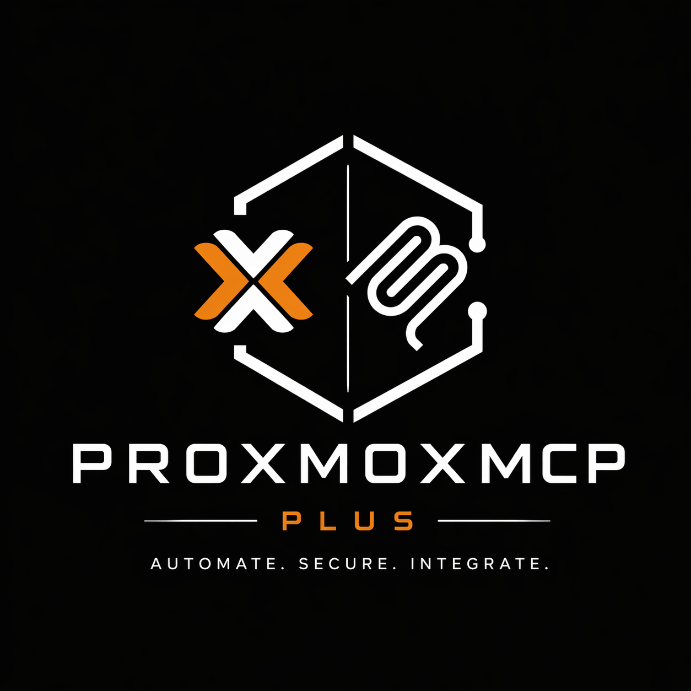
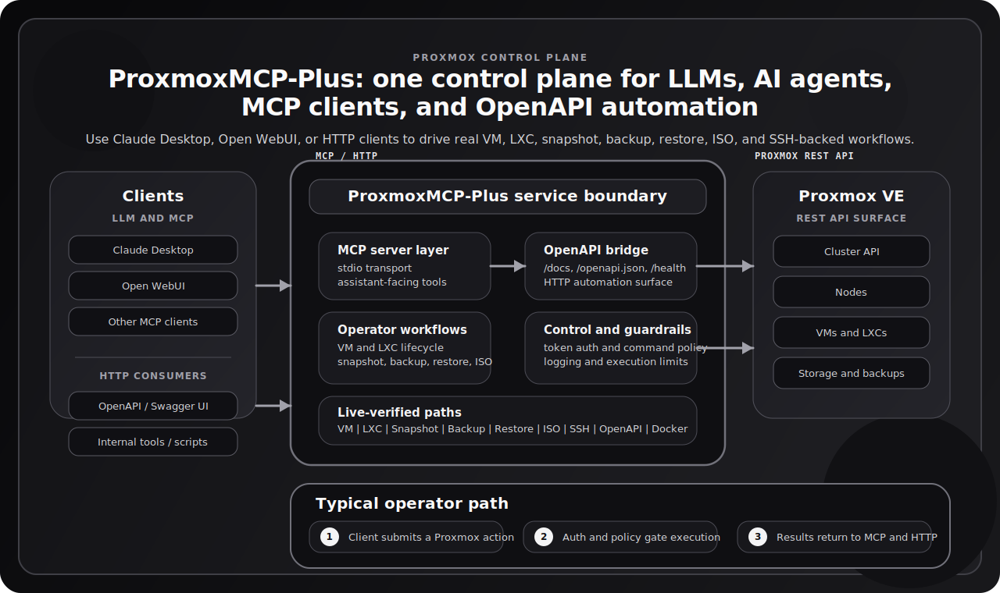
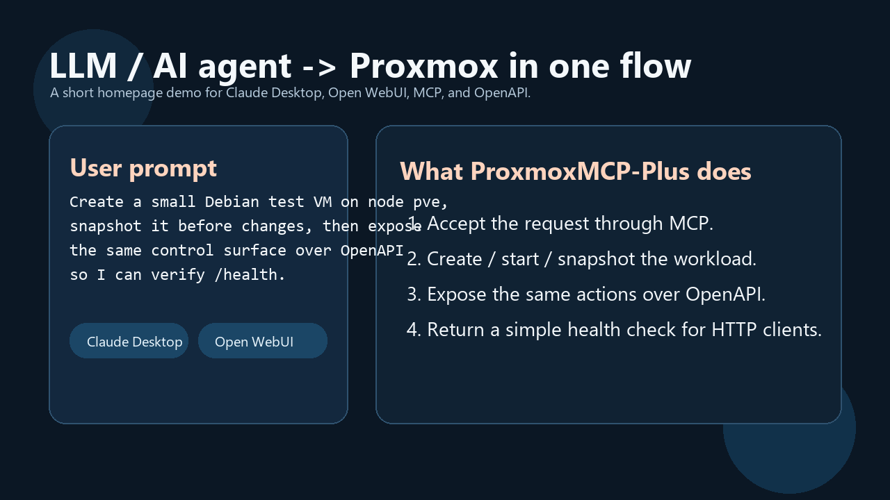

# ProxmoxMCP-Plus

<div align="center">
  
</div>

<p align="center"><strong>Control Proxmox VE from LLMs, AI agents, MCP clients, and OpenAPI tooling with one safer interface for VMs, LXCs, backups, snapshots, ISOs, and container commands.</strong></p>

<p align="center">
  <a href="https://pypi.org/project/proxmox-mcp-plus/"></a>
  <a href="https://github.com/RekklesNA/ProxmoxMCP-Plus/releases"></a>
  <a href="https://github.com/RekklesNA/ProxmoxMCP-Plus/actions/workflows/ci.yml"></a>
  <a href="https://github.com/RekklesNA/ProxmoxMCP-Plus/pkgs/container/ProxmoxMCP-Plus"></a>
  <a href="LICENSE"></a>
</p>

<p align="center">
  <a href="#quick-start">Quick Start</a> |
  <a href="#demo">Demo</a> |
  <a href="#live-environment-verification">Validation</a> |
  <a href="#scenario-templates">Scenarios</a> |
  <a href="#documentation">Docs</a> |
  <a href="https://github.com/RekklesNA/ProxmoxMCP-Plus/wiki">Wiki</a>
</p>



## What This Project Is

ProxmoxMCP-Plus is a Proxmox VE control plane that exposes the same operational surface in two forms:

- `MCP` for Claude Desktop, Open WebUI, and other LLM or AI agent clients
- `OpenAPI` for HTTP automation, dashboards, internal tools, and no-code workflows

Instead of wiring raw Proxmox API calls, shell scripts, and separate glue services, you get one project that can handle:

- VM and LXC lifecycle actions
- snapshot create, rollback, and delete
- backup and restore workflows
- ISO download and cleanup
- node, storage, and cluster inspection
- SSH-backed container command execution with guardrails

## Why Teams Reach For This

This project exists for the gap between "the Proxmox API is powerful" and "an LLM or AI agent can safely operate real infrastructure."

- `Dual-surface design`: MCP for conversational workflows, OpenAPI for standard automation
- `Operator-oriented`: focuses on real tasks, not just raw low-level endpoints
- `Safer by default`: auth, command policy, and explicit execution paths
- `Evidence over claims`: documented workflows are backed by live-environment verification

## Quick Start

### 1. Prepare Proxmox access

Read the official Proxmox docs first if you are setting up a fresh lab:

- [Proxmox VE installation guide](https://pve.proxmox.com/pve-docs/pve-installation-plain.html)
- [Proxmox VE API guide](https://pve.proxmox.com/wiki/Proxmox_VE_API)
- [Proxmox VE administration guide](https://pve.proxmox.com/pve-docs/pve-admin-guide.html)
- [Linux Container guide](https://pve.proxmox.com/wiki/Linux_Container)

At minimum, `proxmox-config/config.json` needs:

- `proxmox.host`
- `proxmox.port`
- `auth.user`
- `auth.token_name`
- `auth.token_value`

Add an `ssh` section as well if you want container command execution.

### 2. Choose one runtime path

#### PyPI

```bash
pip install proxmox-mcp-plus
python main.py
```

#### Docker / GHCR

```bash
docker run --rm -p 8811:8811 \
  -v "$(pwd)/proxmox-config/config.json:/app/proxmox-config/config.json:ro" \
  ghcr.io/rekklesna/proxmoxmcp-plus:latest
```

#### Source

```bash
git clone https://github.com/RekklesNA/ProxmoxMCP-Plus.git
cd ProxmoxMCP-Plus
uv venv
uv pip install -e ".[dev]"
python main.py
```

### 3. Run the HTTP/OpenAPI surface

```bash
docker compose up -d
curl -f http://localhost:8811/health
curl http://localhost:8811/openapi.json
```

### 4. Point an MCP client at the server

Minimal MCP client shape:

```json
{
  "mcpServers": {
    "proxmox-mcp-plus": {
      "command": "python",
      "args": ["/path/to/ProxmoxMCP-Plus/main.py"],
      "env": {
        "PROXMOX_MCP_CONFIG": "/path/to/ProxmoxMCP-Plus/proxmox-config/config.json"
      }
    }
  }
}
```

Client-specific examples for Claude Desktop and Open WebUI are in the [Integrations Guide](docs/wiki/Integrations%20Guide.md).

## Demo

This GIF is a direct terminal recording of an LLM-driven MCP session against a live local Proxmox lab. It shows natural-language control flowing through MCP tools to create and start an LXC, execute a container command, and confirm the HTTP `/health` surface.



## Live Environment Verification

This repository is documented against observed behavior, not a hypothetical feature list. The workflows below were exercised against a live Proxmox lab and are represented by repeatable validation entry points in this repository.

Latest verified workflows:

| Workflow | Status |
| --- | --- |
| VM create / start / stop / delete | Verified |
| VM snapshot create / rollback / delete | Verified |
| Backup create / restore | Verified |
| ISO download / delete | Verified |
| LXC create / start / stop / delete | Verified |
| Container SSH-backed command execution | Verified |
| Container authorized_keys update | Verified |
| Local OpenAPI `/health` and schema | Verified |
| Docker image build and `/health` | Verified |

Validation entry points in this repository:

- `pytest -q`
- `tests/integration/test_real_contract.py`
- `test_scripts/run_real_e2e.py`

## Why This Instead Of Raw API Calls Or Scripts

| Capability | Official Proxmox API | One-off scripts | ProxmoxMCP-Plus |
| --- | --- | --- | --- |
| MCP for LLM and AI agent workflows | No | No | Yes |
| OpenAPI surface for standard HTTP tooling | No | Usually no | Yes |
| VM and LXC operations in one interface | Low-level only | Depends | Yes |
| Snapshot, backup, and restore workflows | Low-level only | Depends | Yes |
| Container command execution with policy controls | No | Custom only | Yes |
| Docker distribution path | No | Rare | Yes |
| Repository-level live-environment verification | N/A | Rare | Yes |

## Scenario Templates

Ready-to-copy examples live in [`examples/`](examples/README.md):

- [Create a test VM](examples/create-test-vm.md)
- [Roll back a risky change with snapshots](examples/rollback-snapshot.md)
- [Download an ISO and create an LXC](examples/download-iso-and-create-lxc.md)

These are written for both human operators and LLM-driven usage.

## Documentation

The README is intentionally optimized for fast GitHub comprehension. Longer operational docs live in `docs/wiki/` and can also be published to the GitHub Wiki.

| If you need to... | Start here |
| --- | --- |
| Understand the project and deployment flow | [Wiki Home](docs/wiki/Home.md) |
| Configure and run against a Proxmox environment | [Operator Guide](docs/wiki/Operator%20Guide.md) |
| Connect Claude Desktop or Open WebUI | [Integrations Guide](docs/wiki/Integrations%20Guide.md) |
| Review security and command policy | [Security Guide](docs/wiki/Security%20Guide.md) |
| Inspect tool groups and behavior | [API & Tool Reference](docs/wiki/API%20%26%20Tool%20Reference.md) |
| Debug startup, auth, or health issues | [Troubleshooting](docs/wiki/Troubleshooting.md) |
| Work on the codebase or release it | [Developer Guide](docs/wiki/Developer%20Guide.md) |
| Review release and upgrade notes | [Release & Upgrade Notes](docs/wiki/Release%20%26%20Upgrade%20Notes.md) |

Published wiki:

- [GitHub Wiki Home](https://github.com/RekklesNA/ProxmoxMCP-Plus/wiki/Home)

## Repo Layout

- `src/proxmox_mcp/`: MCP server, config loading, security, OpenAPI bridge
- `main.py`: MCP entrypoint for local and client-driven usage
- `docker-compose.yml`: HTTP/OpenAPI runtime
- `test_scripts/run_real_e2e.py`: live Proxmox and Docker/OpenAPI path
- `tests/`: unit and integration coverage
- `examples/`: scenario-driven prompts and HTTP examples
- `docs/wiki/`: longer-form operator, integration, and reference docs

## Development Checks

```bash
pytest -q
ruff check .
mypy src tests main.py test_scripts/run_real_e2e.py
python -m build
```

## License

[MIT](LICENSE)
