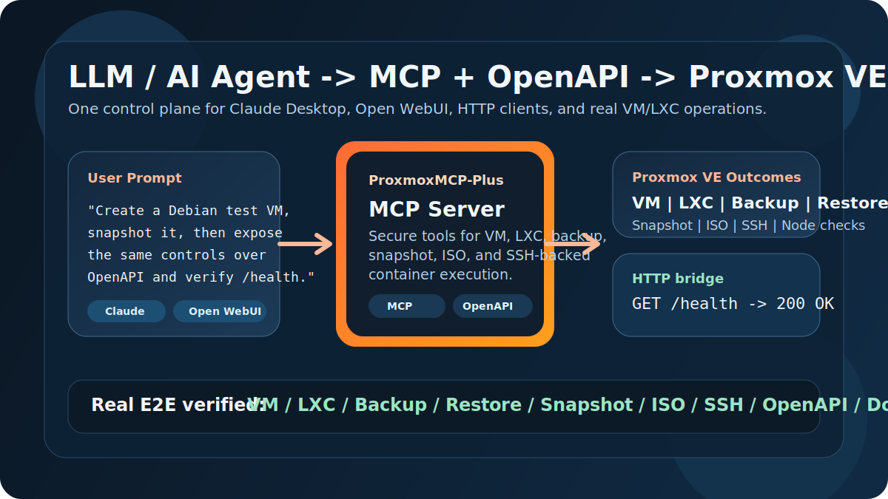

# ProxmoxMCP-Plus

<div align="center">
  
</div>

<p align="center"><strong>Use MCP and OpenAPI to safely control Proxmox VE VMs, LXCs, backups, snapshots, and ISO workflows from LLMs, AI agents, Claude Desktop, and Open WebUI.</strong></p>

<p align="center">
  <a href="https://pypi.org/project/proxmox-mcp-plus/"></a>
  <a href="https://github.com/RekklesNA/ProxmoxMCP-Plus/releases"></a>
  <a href="https://github.com/RekklesNA/ProxmoxMCP-Plus/actions/workflows/ci.yml"></a>
  <a href="https://github.com/RekklesNA/ProxmoxMCP-Plus/pkgs/container/ProxmoxMCP-Plus"></a>
  <a href="LICENSE"></a>
</p>

<p align="center">
  <a href="#30-second-demo">30-second Demo</a> |
  <a href="#real-e2e-proof">Real E2E Proof</a> |
  <a href="#install">Install</a> |
  <a href="#scenario-templates">Scenario Templates</a> |
  <a href="https://github.com/RekklesNA/ProxmoxMCP-Plus/wiki">Wiki</a>
</p>



## Why This Project Exists

Most Proxmox automation stops at raw API calls, one-off scripts, or UI-only workflows.

ProxmoxMCP-Plus gives you:

- `MCP` tools for Claude Desktop, Open WebUI, and other LLM or AI agent workflows
- `OpenAPI` endpoints for HTTP clients, internal tools, and no-code integrations
- `Guardrails` such as token auth, command policy, and safer execution paths
- `Real operator workflows` for VM, LXC, backup, restore, snapshot, ISO, and SSH-backed container execution

If you want an LLM or AI assistant to do more than just explain Proxmox, this is the missing control plane.

## 30-second Demo

What a user says in Claude Desktop or Open WebUI:

```text
Create a small Debian test VM on node pve, snapshot it before changes,
and expose the same control surface over OpenAPI so I can verify /health.
```

What ProxmoxMCP-Plus enables:

1. The LLM calls MCP tools to create and start the VM.
2. The same server exposes matching OpenAPI endpoints for automation or dashboards.
3. `/health` confirms the HTTP bridge is alive.
4. The operator can later snapshot, roll back, back up, or delete the workload from the same interface.

HTTP verification:

```bash
curl -f http://localhost:8811/health
curl http://localhost:8811/openapi.json
```

This is the core pitch in one sentence:

> one Proxmox control plane for both LLM-native workflows and standard HTTP/OpenAPI automation.

## Real E2E Proof

The strongest claim here is not "has features". It is "the important paths were exercised against a real Proxmox lab".

Latest verified live coverage:

| Capability | Real lab status |
| --- | --- |
| VM create / start / stop / delete | Verified |
| VM snapshot create / rollback / delete | Verified |
| Backup create / restore | Verified |
| ISO download / delete | Verified |
| LXC create / start / stop / delete | Verified |
| Container SSH-backed command execution | Verified |
| Container authorized_keys update | Verified |
| Local OpenAPI `/health` and schema | Verified |
| Docker image build and `/health` | Verified |

Validation entry points in this repo:

- `pytest -q`
- `tests/integration/test_real_contract.py`
- `test_scripts/run_real_e2e.py`

## Install

Three supported ways to get started:

### 1. PyPI

```bash
pip install proxmox-mcp-plus
```

### 2. Docker / GHCR

```bash
docker run --rm -p 8811:8811 \
  -v "$(pwd)/proxmox-config/config.json:/app/proxmox-config/config.json:ro" \
  ghcr.io/rekklesna/proxmoxmcp-plus:latest
```

### 3. Source

```bash
git clone https://github.com/RekklesNA/ProxmoxMCP-Plus.git
cd ProxmoxMCP-Plus
uv venv
uv pip install -e ".[dev]"
```

Run the MCP server:

```bash
python main.py
```

Run the OpenAPI bridge:

```bash
docker compose up -d
```

## Quick Proxmox Setup

Do these before blaming the project:

- Install Proxmox VE from the official guide: [Installation Guide](https://pve.proxmox.com/pve-docs/pve-installation-plain.html)
- Create a Proxmox API token and put it in `proxmox-config/config.json`: [Proxmox VE API](https://pve.proxmox.com/wiki/Proxmox_VE_API)
- Make sure your node has a bridge such as `vmbr0`: [Administration Guide](https://pve.proxmox.com/pve-docs/pve-admin-guide.html)
- For LXC workflows, ensure at least one template is available or let the live E2E script download one: [Linux Container Guide](https://pve.proxmox.com/wiki/Linux_Container)
- For container command execution, add the `ssh` section to `proxmox-config/config.json`
- If template or ISO downloads fail, check DNS on the Proxmox host first

Minimal config fields:

- `proxmox.host`
- `proxmox.port`
- `auth.user`
- `auth.token_name`
- `auth.token_value`

## Scenario Templates

Ready-to-copy examples live in [`examples/`](examples/README.md).

- [Create a test VM](examples/create-test-vm.md)
- [Roll back a risky change with snapshots](examples/rollback-snapshot.md)
- [Download an ISO and create an LXC](examples/download-iso-and-create-lxc.md)

These examples include:

- plain-language prompts for Claude or Open WebUI
- example OpenAPI requests
- expected operator outcome

## Why Share This Instead of Raw Scripts

| Capability | Official Proxmox API | One-off scripts | ProxmoxMCP-Plus |
| --- | --- | --- | --- |
| MCP for LLM / AI agents | No | No | Yes |
| OpenAPI bridge | No | Usually no | Yes |
| VM + LXC lifecycle in one interface | Low-level only | Depends | Yes |
| Snapshot / backup / restore workflows | Low-level only | Depends | Yes |
| Container SSH-backed execution | No | Custom only | Yes |
| Command policy / guardrails | No | Rare | Yes |
| Real repo-level E2E coverage | N/A | Rare | Yes |

## What You Can Build With It

- `Claude Desktop + Proxmox`: ask an LLM to create a sandbox VM, list nodes, or roll back snapshots
- `Open WebUI + homelab`: expose Proxmox actions to a self-hosted AI assistant
- `AI infra tools + HTTP`: call `/openapi.json` and integrate with dashboards or internal portals
- `Operator workflows`: use one control surface for read-only checks and write operations

## Repo Structure

- `src/proxmox_mcp/`: server, tools, config, security, formatting
- `test_scripts/run_real_e2e.py`: live Proxmox, OpenAPI, Docker smoke path
- `tests/`: unit and integration coverage
- `proxmox-config/`: example and runtime config
- `examples/`: copy-paste usage templates for LLM and HTTP flows

## Release and Distribution

- PyPI package: [proxmox-mcp-plus](https://pypi.org/project/proxmox-mcp-plus/)
- GitHub releases: [Releases](https://github.com/RekklesNA/ProxmoxMCP-Plus/releases)
- GHCR image: `ghcr.io/rekklesna/proxmoxmcp-plus`

Current release notes should describe user-visible ability, not generic bugfixes:

- live Proxmox E2E coverage
- container SSH execution path
- Docker OpenAPI `/health`
- source-vs-installed-package test correctness

## Community and Launch

If you want to promote the project instead of just dropping a link, start here:

- [Launch post draft](docs/launch-post.md)
- [20-30 second demo script](docs/demo-script.md)
- GitHub Discussions
- Reddit: `r/selfhosted`, `r/homelab`, `r/Proxmox`, `r/LocalLLaMA`
- Hacker News: `Show HN`
- X / AI infra / MCP circles

Suggested angle:

> I built an MCP + OpenAPI server that lets LLMs and AI agents operate real Proxmox VE workflows, and I verified the core paths on a live lab.

## Documentation

README is intentionally optimized for fast GitHub conversion. Deep docs live in the wiki:

- [Home](https://github.com/RekklesNA/ProxmoxMCP-Plus/wiki/Home)
- [Operator Guide](https://github.com/RekklesNA/ProxmoxMCP-Plus/wiki/Operator-Guide)
- [Developer Guide](https://github.com/RekklesNA/ProxmoxMCP-Plus/wiki/Developer-Guide)
- [Security Guide](https://github.com/RekklesNA/ProxmoxMCP-Plus/wiki/Security-Guide)
- [Integrations Guide](https://github.com/RekklesNA/ProxmoxMCP-Plus/wiki/Integrations-Guide)
- [API & Tool Reference](https://github.com/RekklesNA/ProxmoxMCP-Plus/wiki/API-&-Tool-Reference)
- [Troubleshooting](https://github.com/RekklesNA/ProxmoxMCP-Plus/wiki/Troubleshooting)
- [Release & Upgrade Notes](https://github.com/RekklesNA/ProxmoxMCP-Plus/wiki/Release-&-Upgrade-Notes)

## Development

```bash
pytest -q
ruff check .
mypy src tests main.py test_scripts/run_real_e2e.py
python -m build
```

## License

[MIT License](LICENSE)
